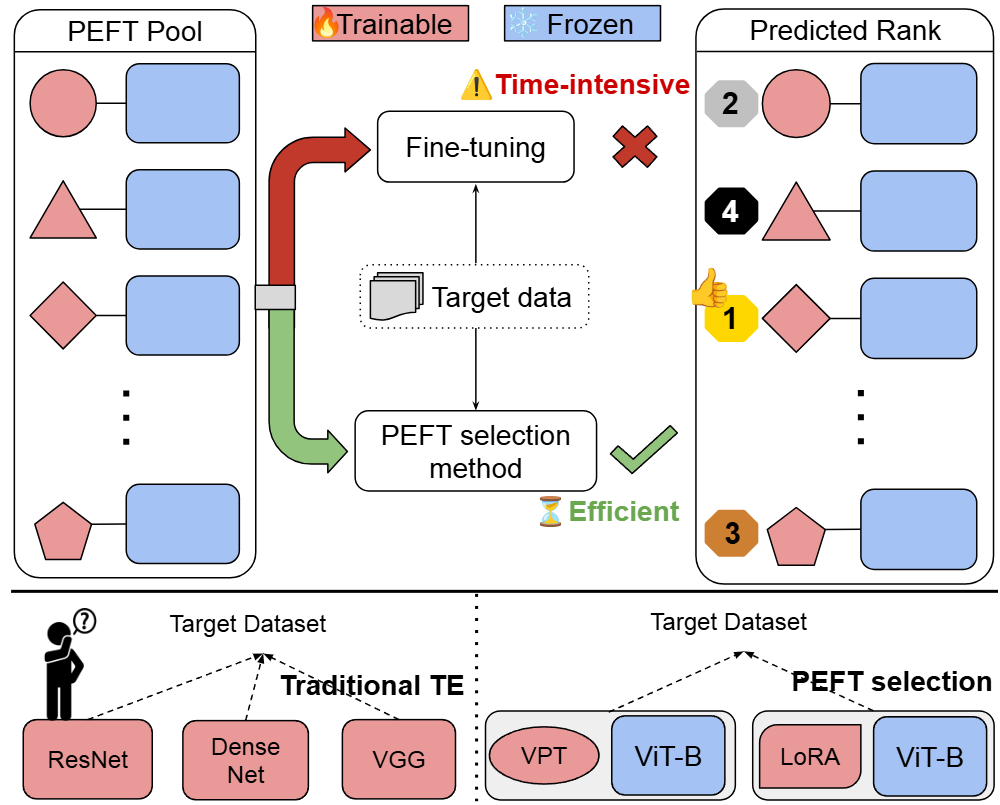

# Diffusion-Guided Transferability Estimation for Parameter-Efficient Fine-Tuning

📄 Published at ICCV 2025, Hawaii



## Requirements

- PyTorch version 1.9.0
- torchvision version 0.10.0
- CUDA version 11.1

To install the required packages, run the following command:

```bash
conda install pytorch==1.9.0 torchvision==0.10.0 cudatoolkit=11.1 -c pytorch
pip install timm==0.4.9
```

## Feature Extraction Preparation

Follow the repository [PETL-ViT](https://github.com/JieShibo/PETL-ViT.git) and [NOAH](https://github.com/ZhangYuanhan-AI/NOAH.git) to extract the features. Store the features in `/features/*`.

The features directory is organized as follows:

```
features/
├── LORA_peft/
│   ├── sun397/         
│   ├── svhn/           
│   └── ...
│   
├── VPT_peft/
│   ├── caltech101/     
│   ├── cifar/          
│   ├── clevr_count/    
│   ├── clevr_dist/     
│   └── ...
└── ...
```

## Pipeline of PEFT Selection 


### Step 1: Evaluate the traditional transferability of PEFTs on all the datasets

```bash
python peft_previous.py --metric NCTI 
```

### Step 2: Evaluate our approach for PEFT selection on all the datasets

```bash
python diffusion_peft.py
python create_diffusion_score.py
```

### Step 3: Calculate the ranking correlation

```bash
python tw_diffusion.py --metric diffusion
```

### Acknowledgement:

This code repository is developed based on [SFDA](https://github.com/TencentARC/SFDA.git), [PETL-ViT](https://github.com/JieShibo/PETL-ViT.git), and [NOAH](https://github.com/ZhangYuanhan-AI/NOAH.git).
